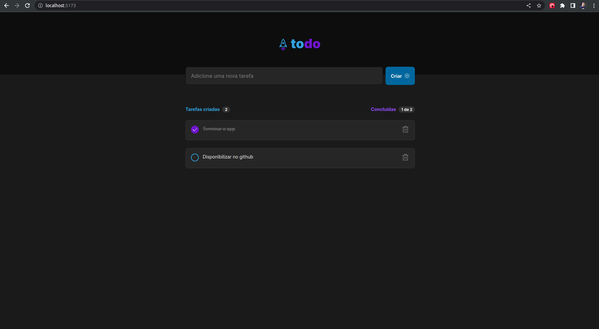

<h1 align="center">
     🚀 ToDo Rocket List
</h1>

<h3 align="center">
    App para criação de listas
</h3>

<p align="center">
  

  
  
  <a href="https://github.com/gabshs/todo-rocket-app/commits/main">
    
  </a>
    
   <a href="https://github.com/gabshs/todo-rocket-app/stargazers">
    
  </a>
</p>

<h4 align="center">
	🚧   Concluído  🚧
</h4>

# Tabela de conteúdos

<p align="center">  <a href="#objetivo">Objetivo</a> • <a href="#layout">Layout</a> • <a href="#how-to">Como executar</a> • <a href="#tecnologias">Tecnologias</a>  • <a href="#autor">Autor</a>  </p>

## 💻 Objetivo

App desenvolvido para concluir o desafio da Rocketseat e aprimorar meus aprendizados de React. <a href="https://www.figma.com/file/0n0zDN7zbzhRbaEO74Xesx/ToDo-List/duplicate">Link do projeto no Figma</a>.

---

## 🎨 Layout

<p align="center">
  
</p>

---

## 🚀 Como executar o projeto

### Pré-requisitos

Antes de começar, você vai precisar ter instalado em sua máquina as seguintes ferramentas:
[Git](https://git-scm.com), [Node](https://nodejs.org/).
Além disto é bom ter um editor para trabalhar com o código como [VSCode](https://code.visualstudio.com/).

#### 🎲 Rodando o projeto

```bash

# Clone este repositório
$ git clone git@github.com:gabshs/todo-rocket-app.git

# Acesse a pasta do projeto no terminal/cmd
$ cd todo-rocket-app

# Instale as dependências
$ npm install

# Execute o programa
$ npm run dev

```

---

## 🛠 Tecnologias

As seguintes ferramentas foram usadas na construção do projeto:

- **[React](https://pt-br.reactjs.org/)**
- **[Typescript](https://www.typescriptlang.org/)**
- **[Vite](https://vitejs.dev/)**
- **[Node](https://nodejs.org/)**
- **[Javascript](https://developer.mozilla.org/pt-BR/docs/Web/JavaScript/)**

---

## 🇧🇷 Autor

 
 <br />
 <sub><b>Gabriel Henrique</b></sub>
 <br />

[](https://www.linkedin.com/in/gabriel-henrique-412111197/)
[](mailto:gabriel.hqs03@gmail.com)
